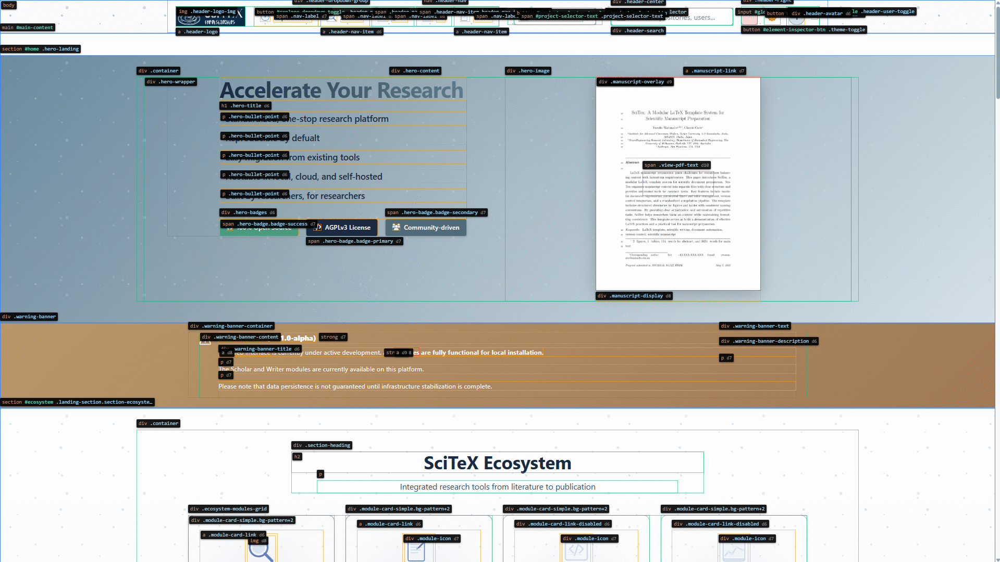

<!-- ---
!-- Timestamp: 2025-11-08 01:38:26
!-- Author: ywatanabe
!-- File: /home/ywatanabe/proj/element-selector/README.md
!-- --- -->

# 🔍 Element Inspector

<div align="center">



**Visual debugging tool for web developers and AI**

</div>

---

## ⌨️ Keyboard Shortcuts

| Shortcut     | Action                         | Example                                                                   |
|--------------|--------------------------------|---------------------------------------------------------------------------|
| `Alt+I`      | Toggle inspector overlay       | [AI Ready Information for a Signle Element](./docs/example_single.md)     |
| `Ctrl+Alt+I` | Start rectangle selection mode | [AI Ready Information for Multiple Elements](./docs/example_rectangle.md) |
| `Esc`        | Cancel selection mode          |                                                                           |

## 🚀 Quick Start

```html
<script src="element-inspector.js"></script>
```

## 💡 Use Cases

- Debug CSS layout issues
- Find elements for web scraping
- Generate element reports for AI assistance
- Visual inspection of DOM structure
- Quick CSS selector generation

## 💖 Support

If this tool saved you debugging time:

[](https://buymeacoffee.com/ywatanabe)

## 📄 License

MIT

---

## Contact

Yusuke Watanabe (ywatanabe@scitex.ai)

<!-- EOF -->